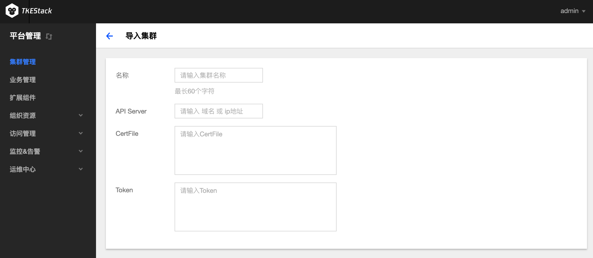

# 快速入门

## 教程介绍

TKEStack 是一款面向私有化环境的开源容器编排引擎。在本教程中，您将了解如何创建 TKEStack 控制台，并使用控制台创建和管理容器集群，在集群内快速、弹性地部署您的服务。

## 操作步骤

### 平台安装

参考：[installation-procedures](../installation/installation-steps.md)

### 集群

平台安装之后，可在【平台管理】控制台的【集群管理】中看到 global 集群。如下图所示：

TKEStack 还可以另外**新建独立集群**以及**导入已有集群**实现**多集群的管理**。

> 注意：**新建独立集群**和**导入已有集群**都属于[TKEStack 架构](../installation/installation-architecture.md)中的**业务集群**。

#### 新建独立集群

1. 登录 TKEStack，右上角会出现当前登录的用户名，示例为 admin。
2. 切换至【平台管理】控制台。
3. 在“集群管理”页面中，单击【新建独立集群】。如下图所示：

1. 在“新建独立集群”页面，填写集群的基本信息。新建的集群需满足[installation requirements](../installation/environment-requirement.md)的需求，在满足需求之后，TKEStack 的集群添加非常便利。如下图所示,只需填写【集群名称】、【目标机器】、【密码】，其他保持默认即可添加新的集群。

> 注意：若【保存】按钮是灰色，单击附近空白处即可变蓝

1. 集群名称**：** 支持**中文**，小于 60 字符即可
2. Kubernetes 版本**：** 选择合适的 kubernetes 版本，各版本特性对比请查看 [Supported Versions of the Kubernetes Documentation](https://kubernetes.io/docs/home/supported-doc-versions/)。（**建议使用默认值**）
3. 网卡名称： 最长 63 个字符，只能包含小写字母、数字及分隔符\(' - '\)，且必须以小写字母开头，数字或小写字母结尾。（**建议使用默认值 eth0**）
4. VIP ：高可用 VIP 地址。（**按需使用**）
5. GPU：选择是否安装 GPU 相关依赖。（**按需使用**）
6. pGPU：平台会自动为集群安装 [GPUManager](../key-features/gpumanager.md) 扩展组件
7. vGPU：平台会自动为集群安装 [Nvidia-k8s-device-plugin](https://github.com/NVIDIA/k8s-device-plugin)
8. 容器网络 ：将为集群内容器分配在容器网络地址范围内的 IP 地址，您可以自定义三大私有网段作为容器网络， 根据您选择的集群内服务数量的上限，自动分配适当大小的 CIDR 段用于 kubernetes service；根据您选择 Pod 数量上限/节点，自动为集群内每台云服务器分配一个适当大小的网段用于该主机分配 Pod 的 IP 地址。（**建议使用默认值**）
9. **CIDR**： 集群内 Sevice、 Pod 等资源所在网段。
10. **Pod 数量上限/节点**： 决定分配给每个 Node 的 CIDR 的大小。
11. **Service 数量上限/集群** ：决定分配给 Sevice 的 CIDR 大小。
12. 目标机器 ：
13. **目标机器**：节点的内网地址。（建议: Master&Etcd 节点配置**4 核**及以上的机型）
14. **SSH 端口**： 请确保目标机器安全组开放 22 端口和 ICMP 协议，否则无法远程登录和 PING 云服务器。（**建议使用默认值 22**）
15. **主机 label**：给主机设置 Label,可用于指定容器调度。（**按需使用**）
16. **认证方式**：连接目标机器的方式
    * **密码认证**：
      * **密码**：目标机器密码
    * **密钥认证**：
      * **私钥**：目标机器秘钥
      * **私钥密码**：目标机器私钥密码，可选填
17. **GPU**： 使用 GPU 机器需提前安装驱动和 runtime。（**按需使用**）

    > 输入以上信息后单击【保存】后还可**继续添加集群的节点**

18. **提交**： 集群信息填写完毕后，【提交】按钮变为可提交状态，单击即可提交。

### 导入已有集群

1. 登录 TKEStack。
2. 切换至【平台管理】控制台。
3. 在“集群管理”页面，单击【导入集群】。如下图所示：

1. 在“导入集群”页面，填写被导入的集群信息。如下图所示：

1. 名称： 被导入集群的名称，最长 60 字符
2. API Server：
3. 被导入集群的 API server 的域名或 IP 地址，注意域名不能加上 https://
4. 端口，此处用的是 https 协议，端口应填 443。
5. CertFile： 输入被导入集群的 cert 文件内容
6. Token： 输入被导入集群创建时的 token 值
7. 单击最下方 【提交】 按钮 。

### 创建业务

> 注：业务可以实现跨集群资源的使用

1. 登录 TKEStack。
2. 在【平台管理】控制台的【业务管理】中，单击 【新建业务】。如下图所示：

1. 在“新建业务”页面，填写业务信息。如下图所示： 

1. 业务名称：不能超过 63 个字符，这里以`my-business`为例
2. 业务成员： [【访问管理】](../user-guide/platform-console/access-mgmt/)中【用户管理】中的用户，这里以`admin`例，即这该用户可以访问这个业务。
3. 集群：
4. 【集群管理】中的集群，这里以`gobal`集群为例
5. 【填写资源限制】可以设置当前业务使用该集群的资源上限（可不限制）
6. 【新增集群】可以添加多个集群，此业务可以使用多个集群的资源（按需添加）
7. 上级业务：支持多级业务管理，按需选择（可不选）

8 .单击最下方 【完成】 按钮即可创建业务。

### 创建业务下的命名空间

1. 登录 TKEStack。
2. 在【平台管理】控制台的【业务管理】中，单击【业务 id】。如下图所示：

1. 单击【Namespace 列表】。如下图标签 1 所示：

> 该页面可以更改业务名称、成员、以及业务下集群资源的限制。

1. 单击【新建 Namespace】。如下图所示： 

1. 在“新建 Namespace”页面中，填写相关信息。如下图所示： 

1. 名称：不能超过 63 个字符，这里以`new-ns`为例
2. 集群：`my-business`业务中的集群，这里以`global`集群为例
3. 资源限制：这里可以限制当前命名空间下各种资源的使用量，可以不设置。

### 创建业务下的 Deployment

1. 登录 TKEStack，点击【平台管理】选项旁边的切换按钮，可以切换到【业务管理】控制台。

> 注意：因为当前登录的是 admin 用户，【业务管理】控制台只包含在[创建业务](quick-starts.md#创建业务)中成员包含 admin 的业务，如果切换到【业务管理】控制台没有看见任何业务，请确认【平台管理】中【业务管理】中的相关业务的成员有没有当前用户，如没有，请添加当前用户。

1. 点击左侧导航栏中的【应用管理】，如果当前用户被分配了多个业务，可通过下图中标签 3 的选择框选择合适的业务。
2. 点击【工作负载】，点击下图标签 4 的【Deployment】，此时进入“Deployment”页面，可通过下图中的标签 5 选择 Deployment 的【命名空间】： 

1. 单击上图标签 6【新建】，进入“新建 Workload ”页面。根据实际需求，设置 Deployment 参数。这里参数很多，其中必填信息已用红框标识：

1. 工作负载名：输入自定义名称，这里以`my-dep`为例
2. 描述：给工作负载添加描述，可不填
3. 标签：给工作负载添加标签，通过工作负载名默认生成
4. 命名空间：根据实际需求进行选择
5. 类型：选择【Deployment（可扩展的部署 Pod）】
6. **数据卷（选填）**：为容器提供存储，目前支持临时路径、主机路径、云硬盘数据卷、文件存储 NFS、配置文件、PVC，还需挂载到容器的指定路径中。如需指定容器挂载至指定路径时，单击【添加数据卷】
   * **临时目录**：主机上的一个临时目录，生命周期和 Pod 一致
   * **主机路径**：主机上的真实路径，可以重复使用，不会随 Pod 一起销毁
   * **NFS 盘**：挂载外部 NFS 到 Pod，用户需要指定相应 NFS 地址，格式：127.0.0.1:/data
   * **ConfigMap**：用户选择在业务 Namespace 下的[ConfigMap](../user-guide/business-console/workload-mgmt/pei-zhi-guan-li/configmap.md)
   * **Secret**：用户选择在业务 namespace 下的[Secret](../user-guide/business-console/workload-mgmt/pei-zhi-guan-li/secret.md)
   * **PVC**：用户选择在业务 namespace 下的[PVC](../user-guide/business-console/workload-mgmt/cun-chu/pv-he-pvc.md)
7. **实例内容器**：根据实际需求，为 Deployment 的一个 Pod 设置一个或多个不同的容器。如下图所示：
   * **名称**：自定义，这里以`my-container`为例
   * **镜像**：根据实际需求进行选择，这里以`nginx`为例
     * **镜像版本（Tag）**：根据实际需求进行填写，不填默认为`latest`
     * **CPU/内存限制**：可根据 [Kubernetes 资源限制](https://kubernetes.io/docs/concepts/configuration/manage-compute-resources-container/) 进行设置 CPU 和内存的限制范围，提高业务的健壮性（**建议使用默认值**）
     * **GPU 限制**：如容器内需要使用 GPU，此处填 GPU 需求
     * **环境变量**：用于设置容器内的变量，变量名只能包含大小写字母、数字及下划线，并且不能以数字开头
       * **新增变量**：自己设定变量键值对
       * **引用 ConfigMap/Secret**：引用已有键值对
     * **高级设置**：可设置 “**工作目录**”、“**运行命令**”、“**运行参数**”、“**镜像更新策略**”、“**容器健康检查**”和“**特权级**”等参数。这里介绍一下镜像更新策略。
       * **镜像更新策略**：提供以下 3 种策略，请按需选择

         若不设置镜像拉取策略，当镜像版本为空或 `latest` 时，使用 Always 策略，否则使用 IfNotPresent 策略

         * **Always**：总是从远程拉取该镜像
         * **IfNotPresent**：默认使用本地镜像，若本地无该镜像则远程拉取该镜像
         * **Never**：只使用本地镜像，若本地没有该镜像将报异常

* **实例数量**：根据实际需求选择调节方式，设置实例数量。
  * **手动调节**：直接设定实例个数
  * **自动调节**：根据设定的触发条件自动调节实例个数，目前支持根据 CPU、内存利用率和利用量出入带宽等调节实例个数
* **显示高级设置**

* **imagePullSecrets**：镜像拉取密钥，用于拉取用户的私有镜像，使用私有镜像首先需要新建 Secret
* **节点调度策略**：根据配置的调度规则，将 Pod 调度到预期的节点。
  * **不使用调度策略**：k8s 自动调度
  * **自定义调度规则**：通过节点的 Label 来实现
    * **强制满足条件**：调度期间如果满足亲和性条件则调度到对应 node，如果没有节点满足条件则调度失败。
    * **尽量满足条件**：调度期间如果满足亲和性条件则调度到对应 node，如果没有节点满足条件则随机调度到任意节点。
* **注释（Annotations）**：给 deployment 添加相应 Annotation，如用户信息等
* **网络模式**：选择 Pod 网络模式
  * **OverLay（虚拟网络）**：基于 IPIP 和 Host Gateway 的 Overlay 网络方案
  * **FloatingIP（浮动 IP）**：支持容器、物理机和虚拟机在同一个扁平面中直接通过 IP 进行通信的 Underlay 网络方案。提供了 IP 漂移能力，支持 Pod 重启或迁移时 IP 不变
  * **NAT（端口映射**）：Kubernetes 原生 NAT 网络方案
  * **Host（主机网络）**：Kubernetes 原生 Host 网络方案
* **创建 Service（可选）**：
* **Service**：勾选【启用】按钮，配置负载端口访问

  > 注意：如果不勾选【启用】则不会创建 Service

* **服务访问方式**：选择是【仅在集群内部访问】该负载还是集群外部通过【主机端口访问】该负载
  * **仅在集群内访问**：使用 Service 的 ClusterIP 模式，自动分配 Service 网段中的 IP，用于集群内访问。数据库类等服务如 MySQL 可以选择集群内访问，以保证服务网络隔离
  * **主机端口访问**：提供一个主机端口映射到容器的访问方式，支持 TCP、UDP、Ingress。可用于业务定制上层 LB 转发到 Node
  * **Headless Service**：不创建用于集群内访问的 ClusterIP，访问 Service 名称时返回后端 Pods IP 地址，用于适配自有的服务发现机制。解析域名时返回相应 Pod IP 而不是 Cluster IP
* **端口映射**：输入负载要暴露的端口并指定通信协议类型（**容器和服务端口建议都使用 80**）
* **Session Affinity:** 点击【显示高级设置】出现，会话保持，设置会话保持后，会根据请求 IP 把请求转发给这个 IP 之前访问过的 Pod。默认 None，按需使用
* 单击【创建 Workload】，完成创建。

​ 当“运行/期望 Pod 数量”相等时，即表示 Deployment 下的所有 Pod 已创建完成。

* 如果在第 5 步中有创建 Service，则可以再【服务】下的【Service】看到与刚刚创建的 Deployment 同名的 Service

### 删除资源

在本节中，启动了`my-business`业务下的 Deployment 和 Service 两种资源，此步骤介绍如何清除所有资源。

#### 删除 Deployment

1. 登录 TKEStack，切换到【业务管理】控制台，选择左侧导航栏中的【应用管理】。
2. 展开【工作负载】下拉项，进入 “Deployment” 管理页面，选择需要删除【Deployment】的业务下相应的【命名空间】，点击要删除的 Deployment 最右边的【更多】，点击【删除】。如下图所示： 
3. 在弹出框中单击【确定】，即可删除 Deployment。

#### 删除 Service

1. 登录 TKEStack，切换到【业务管理】控制台，选择左侧导航栏中的【应用管理】。
2. 展开【服务】下拉项，进入 “Service” 管理页面，选择需要删除【Service】的业务下相应的【命名空间】，点击要删除的 Service 最右边的【删除】。如下图所示： 
3. 在弹出框中单击【确定】，即可删除 Service。

