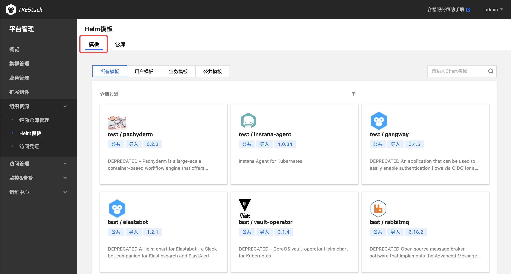
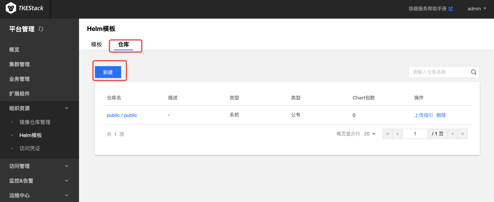
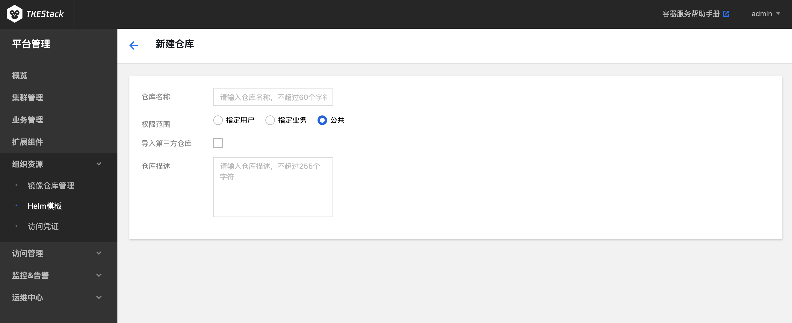
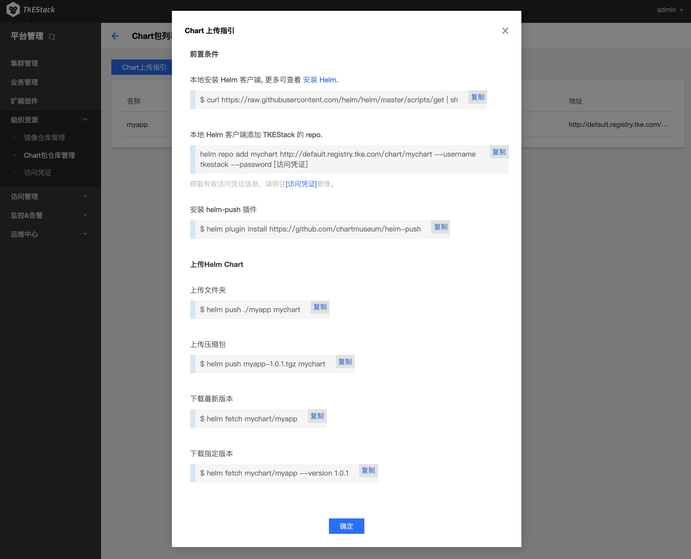
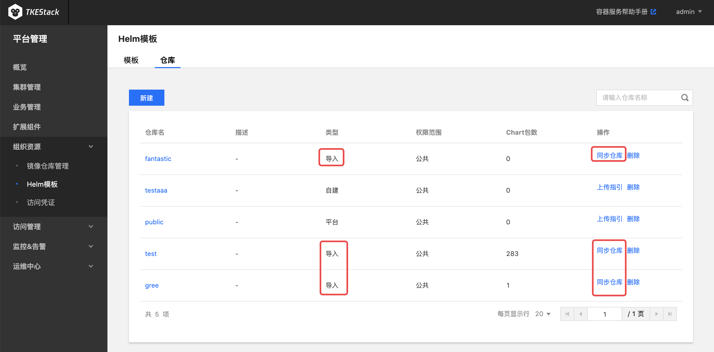

# Helm模板

应用功能是 TKEStack 集成的 [Helm 3.0](https://helm.sh/) 相关功能，为您提供创建 helm chart、容器镜像、软件服务等各种产品和服务的能力。已创建的应用将在您指定的集群中运行，为您带来相应的能力。

## 模板

1. 登录 TKEStack
2. 切换至 【平台管理】控制台，选择 【组织资源】-&gt;【 Helm模板】，点击【模板】 1. **所有模板**：包含下列所有模板 2. **用户模板**：权限范围为“指定用户”的仓库下的所有模板 3. **业务模板**：权限范围为“指定业务”的仓库下的所有模板 4. **公共模板**：权限范围为“公共”的仓库下的所有模板

   

## 仓库

1. 登录 TKEStack
2. 切换至 【平台管理】控制台，选择 【组织资源】-&gt;【 Helm模板】，点击【仓库】
3. 点击【新建】按钮，如下图所示： 
   * 在弹出的 “新建仓库” 页面，填写 仓库 信息，如下图所示：

     

   * **仓库名称：** 仓库名字，不超过60个字符
   * **权限访问**
     * **指定用户**：选择当前仓库可以被哪些平台的用户访问
     * **指定业务**：选择当前仓库可以被哪些平台的业务访问，业务下的成员对该仓库的访问权限在【业务管理】中完成
     * **公共**：平台所有用户都能访问该仓库
   * **导入第三方仓库：** 若已有仓库想导入 TKEStack 中使用，请勾选
     * **第三方仓库地址**：请输入第三方仓库地址
     * **第三方仓库用户名**：若第三方仓库开启了鉴权，需要输入第三方仓库的用户名
     * **第三方仓库密码**：若第三方仓库开启了鉴权，需要输入第三方仓库的密码
   * **仓库描述：** 请输入仓库描述，不超过255个字符
4. 单击【确认】按钮

   **删除仓库**

5. 登录 TKEStack
6. 切换至 【平台管理】控制台，选择 【组织资源】-&gt; 【 Helm 模板】，点击【仓库】，查看 “helm模板仓库”列表
7. 点击列表最右侧【删除】按钮，如下图所示：

   

   **Chart 上传指引**

8. 登录 TKEStack
9. 切换至 【平台管理】控制台，选择 【组织资源】-&gt; 【 Helm模板】，点击【仓库】，查看 “helm模板仓库”列表
10. 点击列表最右侧【上传指引】按钮，如下图所示：

    

11. 根据指引内容，在物理节点上执行相应命令，如下图所示：

    

## 同步导入仓库

1. 登录 TKEStack
2. 切换至 【平台管理】控制台，选择 【组织资源】-&gt;【 Helm模板】，点击【仓库】
3. 点击导入仓库的【同步仓库】按钮，如下图所示：

   

