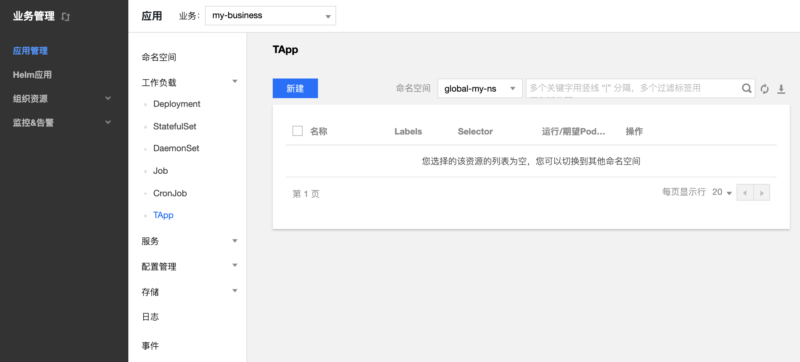
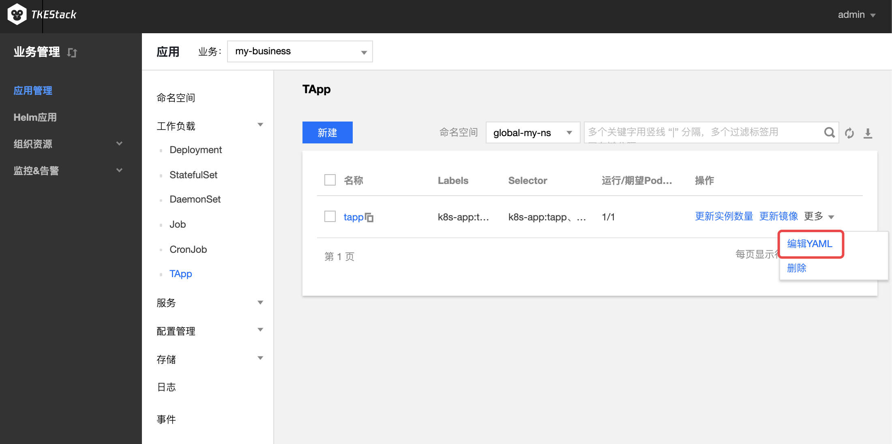
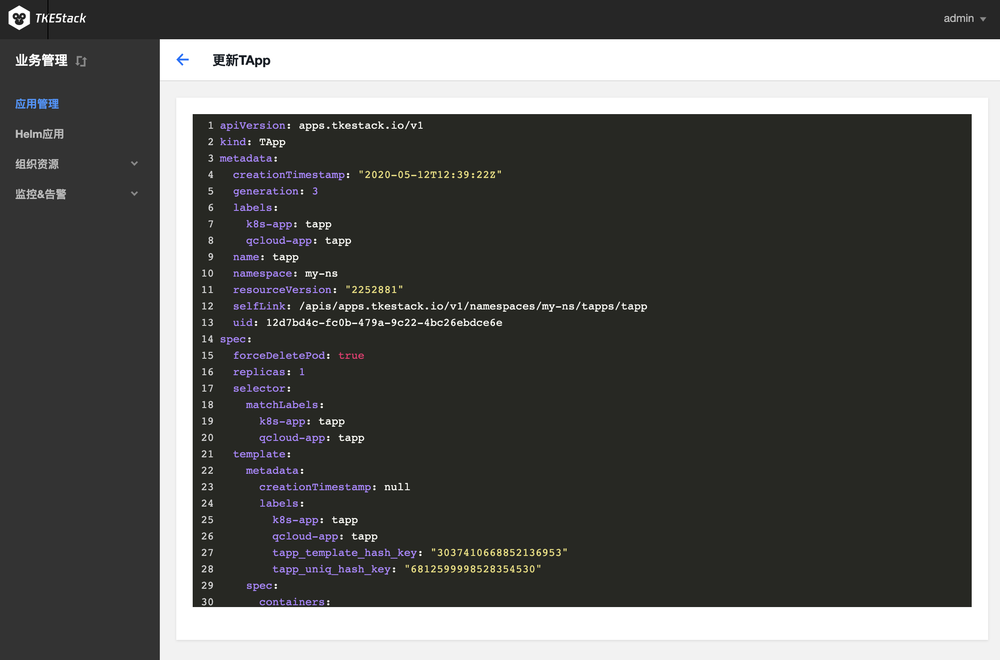
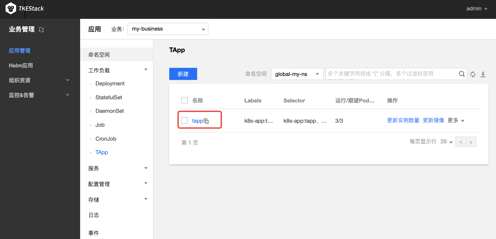
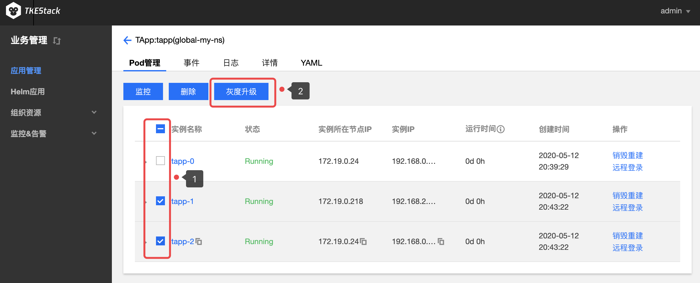

## TApp 

Kubernetes现有应用类型（如：Deployment、StatefulSet等）无法满足很多非微服务应用的需求，比如：操作（升级、停止等）应用中的指定pod、应用支持多版本的pod。如果要将这些应用改造为适合于这些workload的应用，需要花费很大精力，这将使大多数用户望而却步。

为解决上述复杂应用管理场景，TKEStack基于Kubernetes CRD开发了一种新的应用类型TAPP，它是一种通用类型的workload，同时支持service和batch类型作业，满足绝大部分应用场景，它能让用户更好的将应用迁移到Kubernetes集群。

查询[TApp](../../../../产品特色功能/TAPP.md)可查看更多相关信息

## TApp控制台操作指引

### 创建 TApp

> 注意：使用前提，在[【扩展组件】](../../../平台管理控制台/扩展组件.md)安装TApp

1. 登录TKEStack，切换到【业务管理】控制台，选择左侧导航栏中的【应用管理】。
2. 选择需要创建TApp的【业务】下相应的【命名空间】，展开【工作负载】下拉项，进入【TApp】管理页面。如下图所示：
   
3. 单击【新建】，进入 “新建Workload” 页面。根据实际需求，设置 TApp 参数。关键参数信息如下，其中必填项为**工作负载名**、**实例内容器的名称和镜像**：
 - **工作负载名**：输入自定义名称。

 - **标签**：给工作负载添加标签

 - **命名空间**：根据实际需求进行选择。

 - **类型**：选择【TApp】。

 - 节点异常策略

     - 迁移，调度策略与Deployment一致，Pod会迁移到新的节点
     - 不迁移，调度策略与StatefulSel一致，异常pod不会被迁移

 - **数据卷**：根据需求，为负载添加数据卷为容器提供存，目前支持临时路径、主机路径、云硬盘数据卷、文件存储NFS、配置文件、PVC，还需挂载到容器的指定路径中
   - **临时目录**：主机上的一个临时目录，生命周期和Pod一致
   - **主机路径**：主机上的真实路径，可以重复使用，不会随Pod一起销毁
   - **NFS盘**：挂载外部NFS到Pod，用户需要指定相应NFS地址，格式：127.0.0.1:/data
   - **ConfigMap**：用户在业务Namespace下创建的[ConfigMap](../配置管理/ConfigMap.md)
   - **Secret**：用户在业务namespace下创建的[Secret](../配置管理/Secret.md)
   - **PVC**：用户在业务namespace下创建的[PVC](../存储/PV和PVC.md)
   
 - **实例内容器**：根据实际需求，为 TApp 的一个 Pod 设置一个或多个不同的容器。
   
    - **名称**：自定义
    - **镜像**：根据实际需求进行选择
      - **镜像版本（Tag）**：根据实际需求进行填写，不填默认为`latest`
      - **CPU/内存限制**：可根据 [Kubernetes 资源限制](https://kubernetes.io/docs/concepts/configuration/manage-compute-resources-container/) 进行设置 CPU 和内存的限制范围，提高业务的健壮性（**建议使用默认值**）
      - **GPU限制**：如容器内需要使用GPU，此处填GPU需求
      - **环境变量**：用于设置容器内的变量，变量名只能包含大小写字母、数字及下划线，并且不能以数字开头
       * **新增变量**：自己设定变量键值对
       * **引用ConfigMap/Secret**：引用已有键值对
      - **高级设置**：可设置 “**工作目录**”、“**运行命令**”、“**运行参数**”、“**镜像更新策略**”、“**容器健康检查**”和“**特权级**”等参数。这里介绍一下镜像更新策略。
       * **镜像更新策略**：提供以下3种策略，请按需选择
         若不设置镜像拉取策略，当镜像版本为空或 `latest` 时，使用 Always 策略，否则使用 IfNotPresent 策略
         * **Always**：总是从远程拉取该镜像
         * **IfNotPresent**：默认使用本地镜像，若本地无该镜像则远程拉取该镜像
         * **Never**：只使用本地镜像，若本地没有该镜像将报异常
    
 - **实例数量**：根据实际需求选择调节方式，设置实例数量。
   - **手动调节**：直接设定实例个数
   - **自动调节**：根据设定的触发条件自动调节实例个数，目前支持根据CPU、内存利用率和利用量出入带宽等调节实例个数
   
 - **定时调节**：根据Crontab 语法周期性设置实例个数

 - **imagePullSecrets**：镜像拉取密钥，用于拉取用户的私有镜像

 - **节点调度策略**：根据配置的调度规则，将Pod调度到预期的节点。支持指定节点调度和条件选择调度

 - **注释（Annotations）**：给TApp添加相应Annotation，如用户信息等

 - **网络模式**：选择Pod网络模式
    * **OverLay（虚拟网络）**：基于 IPIP 和 Host Gateway 的 Overlay 网络方案
    * **FloatingIP（浮动 IP）**：支持容器、物理机和虚拟机在同一个扁平面中直接通过IP进行通信的 Underlay 网络方案。提供了 IP 漂移能力，支持 Pod 重启或迁移时 IP 不变
    * **NAT（端口映射）**：Kubernetes 原生 NAT 网络方案
    * **Host（主机网络）**：Kubernetes 原生 Host 网络方案
    
 - **Service**：勾选【启用】按钮，配置负载端口访问

   > 注意：如果不勾选【启用】则不会创建Service

- **服务访问方式**：选择是【仅在集群内部访问】该负载还是集群外部通过【主机端口访问】该负载

    - **仅在集群内访问**：使用 Service 的 ClusterIP 模式，自动分配 Service 网段中的 IP，用于集群内访问。数据库类等服务如 MySQL 可以选择集群内访问，以保证服务网络隔离
    - **主机端口访问**：提供一个主机端口映射到容器的访问方式，支持 TCP、UDP、Ingress。可用于业务定制上层 LB 转发到 Node
    - **Headless Service**：不创建用于集群内访问的ClusterIP，访问Service名称时返回后端Pods IP地址，用于适配自有的服务发现机制。解析域名时返回相应 Pod IP 而不是 Cluster IP

- **端口映射**：输入负载要暴露的端口并指定通信协议类型（**容器和服务端口建议都使用80**）

- **Session Affinity:** 点击【显示高级设置】出现，会话保持，设置会话保持后，会根据请求IP把请求转发给这个IP之前访问过的Pod。默认None，按需使用
4. 单击【创建Workload】，完成创建。如下图所示：
当“运行/期望Pod数量”相等时，即表示 TApp 下的所有 Pod 已创建完成。
    

### 更新 TApp

#### 更新 YAML
1. 登录TKEStack，切换到【业务管理】控制台，选择左侧导航栏中的【应用管理】。 
2. 选择需要更新的【业务】下相应的【命名空间】，展开【工作负载】列表，进入【TApp】管理页面。在需要更新 YAML 的 TApp 行中，单击【更多】>【编辑YAML】，进入“更新 TApp” 页面。如下图所示：
   
4. 在 “更新TApp” 页面，编辑 YAML，单击【完成】，即可更新 YAML。如下图所示：

### 调整 Pod 数量
1. 登录 TKEStack，切换到【业务管理】控制台，选择左侧导航栏中的【应用管理】。
2. 选择要变更的业务下相应的命名空间，展开工作负载列表，进入 TApp 管理页面。
3. 点击 TApp 列表操作栏的【更新实例数量】按钮。如下图所示：
   
4. 根据实际需求调整 Pod 数量，如3，单击页面下方的【更新实例数目】即可完成调整。

### TApp特色功能-指定pod灰度升级

1. 登录 TKEStack，切换到【业务管理】控制台，选择左侧导航栏中的【应用管理】。

2. 选择要变更的业务下相应的【命名空间】，展开【工作负载】列表，进入【 TApp】 管理页面，点击进入要灰度升级的 TApp名称。如下图所示：
   

3. 如下图标签1所示，可选指定需要灰度升级的pod，然后点击下图中标签2 的【灰度升级】即可升级指定pod。

   

4. 在弹出的 “回滚资源” 提示框中，单击【确定】即可完成回滚。

   > 注意：此页面同时可完成指定Pod监控和删除

查询[TApp](../../../../features/tapp.md)可查看更多相关信息